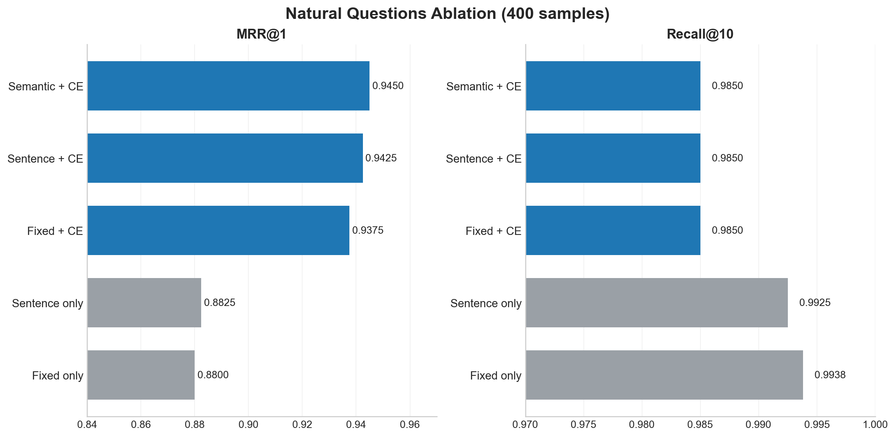

# Natural Questions Ablation Summary (400 samples)

This ablation compares chunking and reranking choices on a 400-sample subset of the BEIR Natural Questions test set.

**Shared setup**
- Embedding model: `BAAI/bge-large-en-v1.5`
- Retrieval mode: `hybrid`
- Candidate depth before reranking: `retrieve_k=20`
- Reranker: `cross-encoder/ms-marco-MiniLM-L-6-v2` where enabled

## Headline

The clearest result is that reranking matters more than chunking. Once hybrid retrieval is followed by a cross-encoder, all three chunking strategies land in a very tight band, with `semantic + cross-encoder` finishing first at `MRR@1 = 0.9450` and `MRR@10 = 0.9638`.

## Key takeaways

1. **Cross-encoder reranking is the biggest lever.**
   - `sentence + cross-encoder` improves `MRR@1` from `0.8825` to `0.9425` over `sentence + none` (`+0.0600`).
   - `fixed + cross-encoder` improves `MRR@1` from `0.8800` to `0.9375` over `fixed + none` (`+0.0575`).
   - The same pattern holds at deeper cutoffs: `MRR@10` moves from `0.9248 -> 0.9628` for sentence chunks and `0.9225 -> 0.9604` for fixed chunks.

2. **Chunking choice has only a small effect once reranking is enabled.**
   - `semantic + cross-encoder`: `MRR@1 = 0.9450`
   - `sentence + cross-encoder`: `MRR@1 = 0.9425`
   - `fixed + cross-encoder`: `MRR@1 = 0.9375`
   - The spread between best and worst reranked setups is only `0.0075` at `MRR@1` and `0.0034` at `MRR@10`.

3. **There is a precision-vs-coverage pattern in the results.**
   - With cross-encoder reranking, `MRR@1` is higher.
   - Without reranking, `Recall@10` is slightly higher (`0.9925` to `0.9938` without CE vs `0.9850` with CE).

4. **Semantic chunking is the best overall default, but the margin is modest.**
   - It gives the top score at `MRR@1`, `MRR@5`, and `MRR@10`.
   - That said, `sentence + cross-encoder` is nearly identical, so if sentence splitting is cheaper or operationally simpler, the quality trade-off looks very small on this subset.

## Compact results table

| Configuration | MRR@1 | MRR@10 | Hit@10 | Recall@10 |
|---|---:|---:|---:|---:|
| Semantic + cross-encoder | 0.9450 | 0.9638 | 0.9925 | 0.9850 |
| Sentence + cross-encoder | 0.9425 | 0.9628 | 0.9925 | 0.9850 |
| Fixed + cross-encoder | 0.9375 | 0.9604 | 0.9925 | 0.9850 |
| Sentence only | 0.8825 | 0.9248 | 0.9950 | 0.9925 |
| Fixed only | 0.8800 | 0.9225 | 0.9975 | 0.9938 |

## Recommendation

For Natural Questions, the best default from this slice of experiments is:

`semantic chunking + hybrid retrieval + cross-encoder reranking`

If latency or cost becomes more important than squeezing out the last few ranking points, `sentence chunking + cross-encoder` looks like a very reasonable fallback because it stays within `0.0025` MRR@1 of the best run.

## Caveats

- These conclusions are based on `400` NQ samples, not the full benchmark.
- The chunking comparison keeps the embedding model and retrieval recipe fixed, so this is a targeted ablation rather than a full search over the design space.
- The reranker here is a relatively lightweight MS MARCO cross-encoder; stronger rerankers may widen or narrow these gaps.
