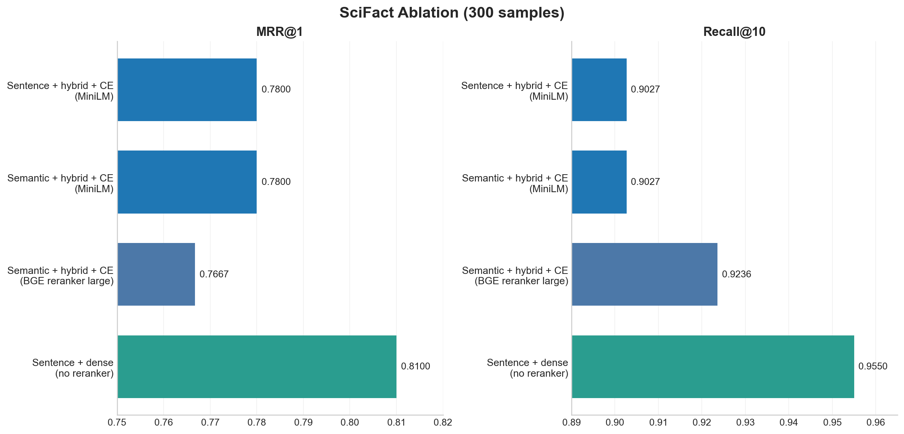

# SciFact Ablation Summary (300 samples)

This ablation compares retrieval and reranking choices on the loaded SciFact test set. Although the run config banner may show `200 + 200`, BEIR/SciFact test provides 300 qrel-backed samples in this project, so the completed SciFact runs report `n_samples = 300`.

**Shared setup**
- Embedding model: `BAAI/bge-large-en-v1.5`
- Main chunking setting: `sentence` or `semantic`
- Compared retrieval modes: `hybrid` and `dense`
- Compared rerankers: `none`, MS MARCO MiniLM cross-encoders, `BAAI/bge-reranker-large`, `ncbi/MedCPT-Cross-Encoder`, and `NeuML/biomedbert-base-reranker`

## Headline

SciFact tells a different story from Natural Questions: generic web-trained rerankers underperform here, but biomedical cross-encoders help. The best run is now `sentence + dense retrieval + MedCPT cross-encoder`, which reaches `MRR@1 = 0.8467`, `MRR@10 = 0.8914`, and `Recall@5 = 0.9402`.

## Key takeaways

1. **Domain-matched cross-encoders are the strongest SciFact rerankers.**
   - `sentence + dense + MedCPT CE` improves over dense retrieval without reranking by `+0.0367` on `MRR@1` and `+0.0268` on `MRR@10`.
   - `sentence + dense + BiomedBERT CE` also improves over the dense baseline by `+0.0300` on `MRR@1` and `+0.0186` on `MRR@10`.
   - This suggests the reranking issue was model/domain fit, not reranking itself.

2. **Cross-encoder reranking is not universally helpful.**
   - Both `sentence + hybrid + cross-encoder (MiniLM)` and `semantic + hybrid + cross-encoder (MiniLM)` land at roughly `MRR@1 = 0.7800` and `MRR@10 = 0.834`.
   - `sentence + dense + BGE reranker large` reaches only `MRR@1 = 0.7700`, and `sentence + dense + MiniLM-L12` reaches only `MRR@1 = 0.7600`.
   - This is the opposite of the NQ pattern, where a general MS MARCO reranker was a clear win.

3. **Chunking matters less than retrieval/reranking choice here too.**
   - Under MiniLM cross-encoder reranking, `sentence` and `semantic` chunking are nearly identical:
   - `sentence + hybrid + CE`: `MRR@1 = 0.7800`, `MRR@10 = 0.8345`
   - `semantic + hybrid + CE`: `MRR@1 = 0.7800`, `MRR@10 = 0.8344`
   - The meaningful differences come from retrieval mode and reranker behavior, not chunk boundaries.

## Compact results table

| Configuration | MRR@1 | MRR@10 | Hit@5 | Recall@5 |
|---|---:|---:|---:|---:|
| Sentence + dense + CE (MedCPT) | 0.8467 | 0.8914 | 0.9467 | 0.9402 |
| Sentence + dense + CE (BiomedBERT) | 0.8400 | 0.8832 | 0.9433 | 0.9367 |
| Sentence + dense + none | 0.8100 | 0.8646 | 0.9333 | 0.9310 |
| Sentence + dense + CE (BGE reranker large) | 0.7700 | 0.8388 | 0.9236 | 0.9236 |
| Sentence + dense + CE (MiniLM-L12) | 0.7600 | 0.8219 | 0.9133 | 0.9038 |
| Sentence + hybrid + CE (MiniLM-L6) | 0.7800 | 0.8345 | 0.9133 | 0.9027 |
| Semantic + hybrid + CE (MiniLM-L6) | 0.7800 | 0.8344 | 0.9133 | 0.9027 |

## Interpretation

The most plausible explanation is that SciFact needs a reranker that understands biomedical/scientific abstracts rather than only general web passage relevance. The MS MARCO MiniLM rerankers and BGE reranker are good general candidates, but they can reward topical similarity without reliably capturing scientific evidence fit, negation, directionality, or biomedical entity specificity.

The MedCPT and BiomedBERT results change the earlier conclusion: reranking can help SciFact, but only when the reranker is domain-matched. MedCPT is the strongest of the tested options and is the best current default for top-1 ranking quality.

## Recommendation

For SciFact, the best default from this set of runs is:

`sentence chunking + dense retrieval + ncbi/MedCPT-Cross-Encoder`

If latency or model availability is a concern, `sentence chunking + dense retrieval + NeuML/biomedbert-base-reranker` is the next-best reranked option. If reranker latency is unacceptable, `sentence chunking + dense retrieval + no reranker` remains a solid baseline.

## Caveats

- These conclusions are based on the loaded `300`-sample SciFact test set used by the completed local runs.
- Not every row varies just one factor, so this is a practical ablation rather than a perfectly controlled study.
- Reranked runs keep only `RERANK_TOP_K = 5` before metric computation, so `MRR@10`, `Hit@10`, and `Recall@10` in those runs should be interpreted as metrics over the retained reranked set. `MRR@1` and `Recall@5` are the clearest comparisons here.
- The best SciFact run here is `dense + biomedical cross-encoder`, while the NQ best run was `hybrid + general MS MARCO cross-encoder`; that contrast is a useful reminder that retrieval defaults may need to be dataset-specific.
