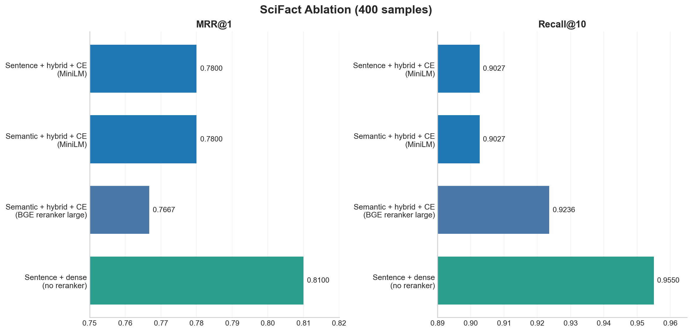

# SciFact Ablation Summary (400 samples)

This ablation compares retrieval and reranking choices on a 400-sample subset of the SciFact test set.

**Shared setup**
- Embedding model: `BAAI/bge-large-en-v1.5`
- Main chunking setting: `sentence` or `semantic`
- Compared retrieval modes: `hybrid` and `dense`
- Compared rerankers: `none`, `cross-encoder/ms-marco-MiniLM-L-6-v2`, and `BAAI/bge-reranker-large`

## Headline

SciFact tells a different story from Natural Questions: the best run here is `sentence + dense retrieval + no reranker`, which reaches `MRR@1 = 0.8100`, `MRR@10 = 0.8646`, and `Recall@10 = 0.9550`. In this slice, reranking does not help.

## Key takeaways

1. **Dense retrieval without reranking is the strongest configuration in this table.**
   - `sentence + dense + none` is best at every reported cutoff among the listed runs.
   - It beats `sentence + hybrid + cross-encoder (MiniLM)` by `+0.0300` on `MRR@1`, `+0.0301` on `MRR@10`, and `+0.0523` on `Recall@10`.

2. **Cross-encoder reranking is not universally helpful.**
   - Both `sentence + hybrid + cross-encoder (MiniLM)` and `semantic + hybrid + cross-encoder (MiniLM)` land at roughly `MRR@1 = 0.7800` and `MRR@10 = 0.834`.
   - The `BAAI/bge-reranker-large` variant improves coverage versus MiniLM (`Recall@10 = 0.9236` vs `0.9027`) but still does not beat dense retrieval without reranking on ranking quality.
   - This is the opposite of the NQ pattern, which suggests SciFact may reward recall-preserving retrieval more than aggressive reranking.

3. **Chunking matters less than retrieval/reranking choice here too.**
   - Under MiniLM cross-encoder reranking, `sentence` and `semantic` chunking are nearly identical:
   - `sentence + hybrid + CE`: `MRR@1 = 0.7800`, `MRR@10 = 0.8345`
   - `semantic + hybrid + CE`: `MRR@1 = 0.7800`, `MRR@10 = 0.8344`
   - The meaningful differences come from retrieval mode and reranker behavior, not chunk boundaries.

## Compact results table

| Configuration | MRR@1 | MRR@10 | Hit@10 | Recall@10 |
|---|---:|---:|---:|---:|
| Sentence + dense + none | 0.8100 | 0.8646 | 0.9567 | 0.9550 |
| Sentence + hybrid + CE (MiniLM) | 0.7800 | 0.8345 | 0.9133 | 0.9027 |
| Semantic + hybrid + CE (MiniLM) | 0.7800 | 0.8344 | 0.9133 | 0.9027 |
| Semantic + hybrid + CE (BGE reranker large) | 0.7667 | 0.8339 | 0.9333 | 0.9236 |

## Interpretation

The most plausible explanation is that SciFact benefits from strong dense retrieval coverage, while the tested rerankers are either too aggressive or mismatched to this dataset. In other words, the rerankers may be improving local ordering in some cases, but not enough to offset the documents they push down or discard.

The `BAAI/bge-reranker-large` result is especially interesting because it raises `Recall@10` relative to the MiniLM reranker but still does not improve `MRR@10`. That suggests better coverage alone is not enough; the top-of-list ordering still is not better than the plain dense baseline.

## Recommendation

For SciFact, the best default from this set of runs is:

`sentence chunking + dense retrieval + no reranker`

If you want to keep exploring reranking on SciFact, the most informative next comparison is probably `dense + no reranker` versus `dense + stronger learned rerankers`, because the current reranked setups are not beating the plain dense baseline.

## Caveats

- These conclusions are based on the provided `400`-sample SciFact slice.
- Not every row varies just one factor, so this is a practical ablation rather than a perfectly controlled study.
- The best SciFact run here is `dense`, while the NQ best run was `hybrid + cross-encoder`; that contrast is a useful reminder that retrieval defaults may need to be dataset-specific.
